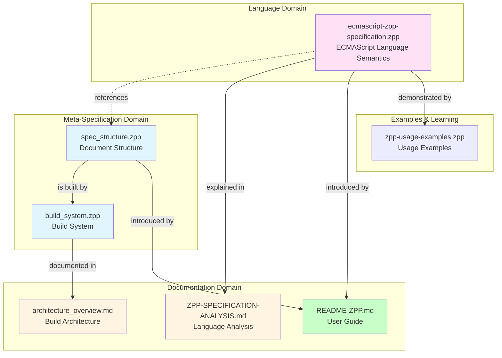

# ECMA-262 Formal Specifications Integration Guide

## Overview

This document explains how the formal Z++ specifications and architecture documentation in this repository work together to provide a comprehensive formal model of both the **ECMAScript language** and the **specification build system**.

## Document Map

### 1. Architecture Documentation

**File**: `architecture_overview.md`

**Purpose**: Provides comprehensive technical architecture documentation with Mermaid diagrams covering:
- Build system architecture and data flow
- CI/CD pipeline structure
- Ecmarkup processing workflow
- Validation and quality control
- Integration boundaries with TC39 ecosystem

**Target Audience**: Developers, maintainers, and contributors to the specification build tooling

### 2. Language Specification (Z++)

**File**: `ecmascript-zpp-specification.zpp`

**Purpose**: Formal specification of the ECMAScript language itself, covering:
- Lexical grammar (tokens, identifiers, literals)
- Syntactic grammar (AST structures, statements, expressions)
- Semantic domains (values, environments, execution contexts)
- Object model (properties, prototypes, extensibility)
- Type system (conversions, coercions)
- Operational semantics (evaluation, completion records)
- Advanced features (modules, async/await, iterators, errors)

**Author**: Deep Tree Echo  
**Lines**: 597  
**Target Audience**: Language implementers, formal methods researchers, standards bodies

### 3. Build System Specification (Z++)

**File**: `build_system.zpp`

**Purpose**: Formal specification of the specification build pipeline, covering:
- File system abstractions and source models
- Build environment state and configuration
- Build operations (clean, copy, transform)
- Ecmarkup processing (parsing, validation, transformation)
- Output generation (single-page HTML, multi-page HTML, PDF)
- Post-processing (snapshot warnings)
- Build invariants and theorems

**Lines**: 15,521 characters  
**Target Audience**: Build tooling maintainers, CI/CD developers

### 4. Document Structure Specification (Z++)

**File**: `spec_structure.zpp`

**Purpose**: Formal specification of the ECMAScript specification document structure, covering:
- Document hierarchy (sections, clauses, annexes)
- Content types (grammar, algorithms, tables, figures)
- Abstract operations and semantics
- Built-in objects specification format
- Cross-references and validation
- Document consistency invariants
- Transformation operations

**Lines**: 14,390 characters  
**Target Audience**: Specification editors, formal verification tools

### 5. Usage Examples (Z++)

**File**: `zpp-usage-examples.zpp`

**Purpose**: Practical examples demonstrating the Z++ specifications  
**Lines**: 285  
**Target Audience**: Learning and reference

### 6. Detailed Analysis

**File**: `ZPP-SPECIFICATION-ANALYSIS.md`

**Purpose**: Deep Tree Echo's architectural philosophy and analysis of the language specification  
**Lines**: 193  
**Target Audience**: Researchers, advanced users

### 7. User Guide

**File**: `README-ZPP.md`

**Purpose**: Overview and introduction to the Z++ specifications  
**Target Audience**: New users, general documentation

## Specification Architecture

### Three-Layer Model

The formal specifications in this repository operate at three distinct architectural layers:

```
┌─────────────────────────────────────────────────────────┐
│ Layer 1: Language Specification                        │
│ (ecmascript-zpp-specification.zpp)                     │
│                                                         │
│ Formalizes: ECMAScript language semantics              │
│ - Lexical & syntactic grammar                          │
│ - Value types and object model                         │
│ - Execution semantics                                  │
│ - Runtime behavior                                     │
└─────────────────────────────────────────────────────────┘
                         ↑
                         │ specifies behavior of
                         │
┌─────────────────────────────────────────────────────────┐
│ Layer 2: Document Structure                            │
│ (spec_structure.zpp)                                   │
│                                                         │
│ Formalizes: Specification document organization        │
│ - Sections, clauses, annexes                           │
│ - Grammar productions format                           │
│ - Algorithm notation                                   │
│ - Cross-references and validation                      │
└─────────────────────────────────────────────────────────┘
                         ↑
                         │ defines structure of
                         │
┌─────────────────────────────────────────────────────────┐
│ Layer 3: Build System                                  │
│ (build_system.zpp)                                     │
│                                                         │
│ Formalizes: Specification build pipeline               │
│ - Source file models                                   │
│ - Build state and operations                           │
│ - Ecmarkup processing                                  │
│ - Output generation                                    │
└─────────────────────────────────────────────────────────┘
```

### Relationships Between Specifications



## Key Concepts

### 1. Formal Specification of a Specification

This repository contains a unique meta-specification structure:

- **Primary Artifact**: `spec.html` (the ECMAScript specification source)
- **Language Formalization**: `ecmascript-zpp-specification.zpp` formalizes what `spec.html` describes
- **Structure Formalization**: `spec_structure.zpp` formalizes how `spec.html` is structured
- **Build Formalization**: `build_system.zpp` formalizes how `spec.html` is transformed into outputs

### 2. Z++ Notation

Z++ is an extension of the Z formal specification language that adds:

- **Object-oriented features** via schemas
- **Temporal logic** for state transitions
- **Partial functions** (⇸) for operations that may fail
- **Set theory** (ℙ) for collections
- **Sequence theory** for ordered structures
- **Predicate logic** for invariants and constraints

### 3. Build System as State Machine

The `build_system.zpp` specification models the build process as a state machine with:

- **States**: `NotStarted`, `InProgress`, `Success`, `Failed`
- **Operations**: State transition functions (e.g., `CleanOutputDirectory`, `GenerateSinglePageHTML`)
- **Invariants**: Properties that must hold throughout the build process
- **Theorems**: `BuildCompleteness`, `BuildDeterminism`

### 4. Document Structure Model

The `spec_structure.zpp` specification provides:

- **Hierarchical Model**: Sections, clauses, subsections
- **Content Types**: Grammar productions, algorithms, tables, figures
- **Validation Rules**: Cross-reference resolution, numbering consistency
- **Transformation Functions**: Document → HTML, PDF, etc.

## Usage Scenarios

### For Language Implementers

**Use**: `ecmascript-zpp-specification.zpp`

This specification provides a mathematical foundation for:
- Understanding language semantics precisely
- Implementing language features correctly
- Verifying implementation correctness against formal model
- Reasoning about edge cases and corner cases

**Example**: When implementing the `typeof` operator, consult the type system section to understand the exact type coercion rules.

### For Specification Editors

**Use**: `spec_structure.zpp` + `architecture_overview.md`

These documents help with:
- Understanding the structure and organization conventions
- Ensuring new sections follow established patterns
- Validating cross-references and section numbering
- Understanding the build process and output formats

**Example**: When adding a new built-in object, consult `spec_structure.zpp` to understand the required schema for constructor, prototype, properties, and methods.

### For Build Tooling Maintainers

**Use**: `build_system.zpp` + `architecture_overview.md`

These documents provide:
- Formal model of the build pipeline
- Understanding of build states and transitions
- Validation requirements and error handling
- Output artifact specifications

**Example**: When modifying the Ecmarkup processor, consult `build_system.zpp` to understand the required invariants and ensure build determinism.

### For Formal Methods Researchers

**Use**: All Z++ specifications

The complete specification suite offers:
- Case study in meta-specification (specifying a specification)
- Application of Z++ to document engineering
- Theorems about specification completeness and consistency
- Integration of multiple specification layers

**Example**: Study the relationship between `BuildDeterminism` theorem in `build_system.zpp` and `SpecificationCompleteness` theorem in `spec_structure.zpp`.

## Verification and Validation

### Build System Verification

The `build_system.zpp` includes two key theorems:

**1. Build Completeness Theorem**
```z++
∀ valid source, environment, config →
  ∃ build pipeline that produces output artifacts on success
```

**Meaning**: Every valid specification source can be successfully built given proper environment and configuration.

**2. Build Determinism Theorem**
```z++
∀ identical inputs → identical outputs
```

**Meaning**: The build process is deterministic—same input always produces same output.

### Document Validation

The `spec_structure.zpp` includes:

**1. Specification Completeness Theorem**
```z++
∀ consistent document →
  (all grammar has semantics) ∧
  (all built-ins are complete) ∧
  (all cross-refs resolve)
```

**Meaning**: A well-formed specification document must have complete semantic definitions.

**2. Specification Evolution Theorem**
```z++
∀ doc1, doc2 where edition(doc1) < edition(doc2) →
  backward compatible ∧ incremental ∧ cross-edition refs valid
```

**Meaning**: New editions preserve compatibility and maintain reference integrity.

## Integration with Existing Tools

### Ecmarkup Integration

The formal specifications complement Ecmarkup by:

- **Formalizing** what Ecmarkup does informally
- **Providing** mathematical foundation for validation rules
- **Enabling** automated verification of build correctness
- **Documenting** the expected behavior precisely

### Test262 Integration

While Test262 provides conformance tests for implementations, the Z++ specifications provide:

- **Formal semantics** that tests are based on
- **Mathematical foundation** for test generation
- **Proof obligations** for implementation correctness

### TC39 Proposal Process Integration

The specifications support the proposal process by:

- **Formalizing** the structure of proposals
- **Validating** consistency with existing specification
- **Ensuring** backward compatibility
- **Documenting** the integration requirements

## Extending the Specifications

### Adding New Language Features

When a Stage 4 proposal is merged:

1. **Update** `ecmascript-zpp-specification.zpp` with new semantic rules
2. **Verify** consistency with existing specifications
3. **Add** new grammar productions if needed
4. **Document** in `ZPP-SPECIFICATION-ANALYSIS.md`

### Extending Build Pipeline

When modifying the build system:

1. **Update** `build_system.zpp` with new states/operations
2. **Verify** build invariants still hold
3. **Update** `architecture_overview.md` with new diagrams
4. **Test** build determinism theorem

### Modifying Document Structure

When changing specification format:

1. **Update** `spec_structure.zpp` with new schema definitions
2. **Verify** document consistency invariants
3. **Update** validation rules
4. **Ensure** backward compatibility where possible

## Best Practices

### For Specification Contributors

1. **Read** `README-ZPP.md` first for overview
2. **Consult** `spec_structure.zpp` for document structure requirements
3. **Follow** existing patterns in `spec.html`
4. **Validate** using build system before submitting PRs

### For Build System Developers

1. **Understand** `build_system.zpp` formal model
2. **Maintain** build determinism invariant
3. **Test** all validation levels (markup, lint, strict)
4. **Document** changes in `architecture_overview.md`

### For Formal Methods Users

1. **Start** with `zpp-usage-examples.zpp` for syntax
2. **Study** `ecmascript-zpp-specification.zpp` for language model
3. **Explore** meta-specifications (`spec_structure.zpp`, `build_system.zpp`)
4. **Analyze** theorems and proofs

## Future Enhancements

### Planned Improvements

1. **Automated Consistency Checking**
   - Tool to verify Z++ specs match `spec.html` content
   - Bidirectional synchronization
   - Automated theorem proving

2. **Enhanced Visualization**
   - Generate diagrams from Z++ specifications
   - Interactive specification browser
   - Visual dependency graphs

3. **Formal Verification Tools**
   - Z++ type checker integration
   - Automated proof assistant
   - Counterexample generation

4. **Extended Coverage**
   - Complete formalization of all ECMAScript features
   - Formalization of WebAssembly/JS integration
   - Formalization of module resolution algorithms

## Resources

### Z++ Language

- **Z Notation**: ISO/IEC 13568:2002
- **Z++ Extensions**: Object-oriented and temporal extensions
- **Tutorial**: See `zpp-usage-examples.zpp` for practical examples

### ECMAScript Specification

- **Latest Spec**: https://tc39.es/ecma262/
- **GitHub Repo**: https://github.com/tc39/ecma262
- **Proposals**: https://github.com/tc39/proposals

### Build Tools

- **Ecmarkup**: https://github.com/tc39/ecmarkup
- **Node.js**: https://nodejs.org/
- **Prince**: https://www.princexml.com/

## Conclusion

The formal specifications and architecture documentation in this repository provide:

- **Mathematical rigor** for the ECMAScript language
- **Precise documentation** of the build system
- **Formal structure** for the specification document
- **Integration** with existing TC39 tooling and processes

Together, these specifications enable:

- **Formal verification** of language properties
- **Automated validation** of specification consistency
- **Precise understanding** of build system behavior
- **Foundation** for tool development and automation

---

**Document Version**: 1.0  
**Created**: 2025-11-12  
**Purpose**: Integration guide for ECMA-262 formal specifications  
**Audience**: Contributors, maintainers, researchers
