# ECMA-262 ECMAScript Specification: Technical Architecture Documentation

## Executive Summary

This document provides a comprehensive technical architecture analysis of the ECMA-262 ECMAScript Language Specification repository. Unlike typical software applications, this repository contains the **formal language specification document** for JavaScript/ECMAScript, along with its build tooling, validation scripts, and formal specifications in Z++.

## Repository Overview

**Repository**: `tc39/ecma262` (forked as `o9nn/ecma262`)  
**Purpose**: Official ECMAScript Language Specification  
**Primary Technology**: Ecmarkup (HTML-based specification markup language)  
**Build System**: Node.js + npm  
**Output**: Multi-format specification documents (HTML, PDF)

## System Architecture

### 1. High-Level Component Architecture

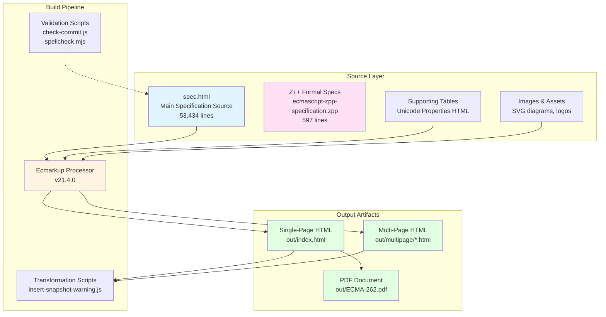

### 2. Build System Data Flow

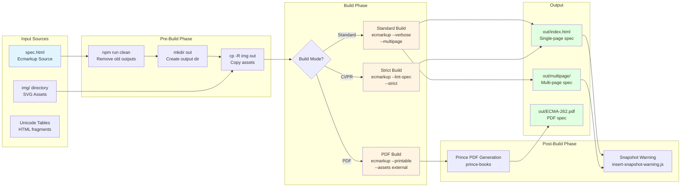

### 3. CI/CD Pipeline Architecture

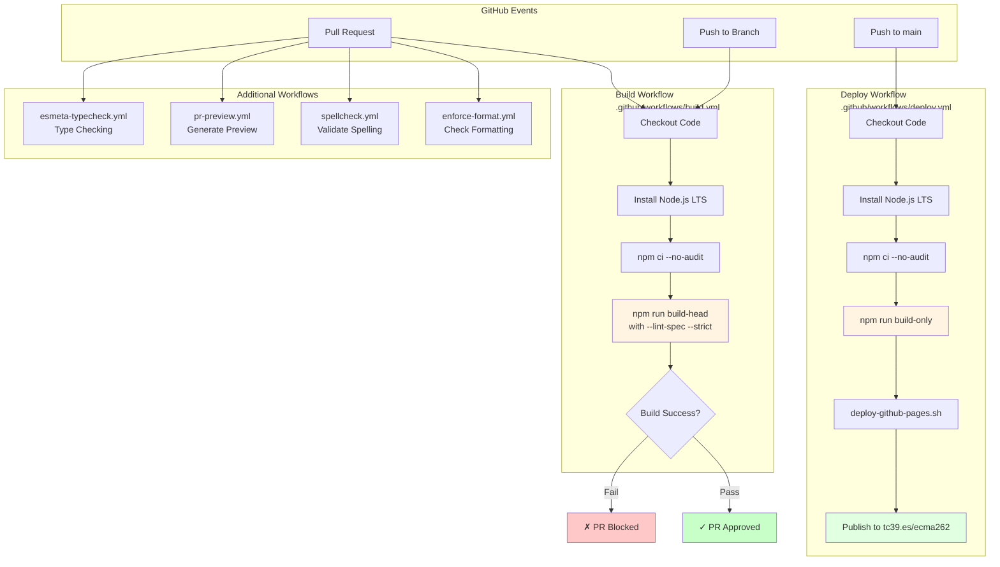

### 4. Specification Validation & Quality Control

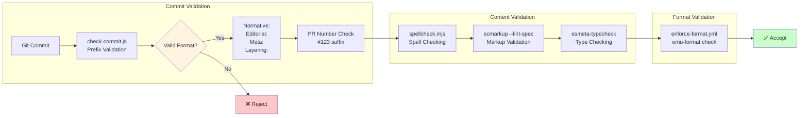

### 5. Ecmarkup Processing Architecture

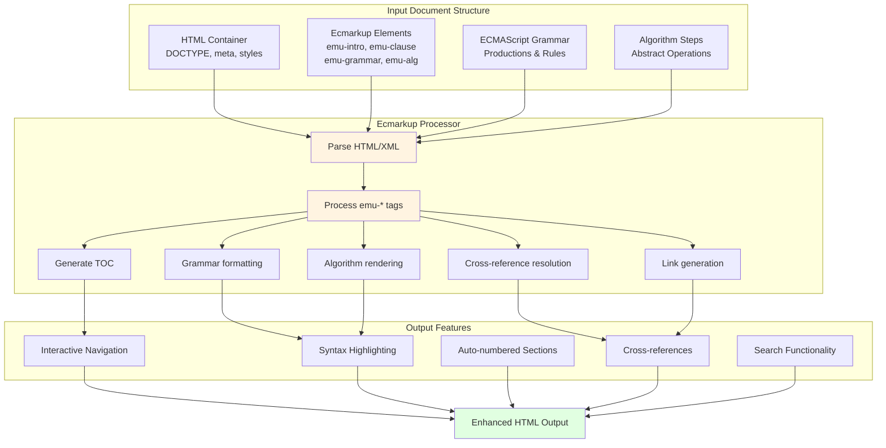

### 6. Module & Script Organization

```mermaid
graph LR
    subgraph "Build Scripts"
        A[package.json<br/>NPM Scripts]
        B[scripts/check-commit.js<br/>Commit Validation]
        C[scripts/insert-snapshot-warning.js<br/>Warning Injection]
        D[scripts/spellcheck.mjs<br/>Spell Checking]
        E[scripts/deploy-github-pages.sh<br/>Deployment]
        F[scripts/publish-biblio.sh<br/>Bibliography Publishing]
    end
    
    subgraph "Configuration"
        G[package.json<br/>Dependencies & Scripts]
        H[.editorconfig<br/>Editor Settings]
        I[esmeta-ignore.json<br/>ESMeta Config]
    end
    
    subgraph "External Dependencies"
        J[ecmarkup@21.4.0<br/>Spec Processor]
        K[jsdom@27.0.0<br/>DOM Manipulation]
        L[prince-books<br/>PDF Generation]
    end
    
    A --> B
    A --> C
    A --> D
    A --> E
    A --> F
    
    G --> J
    G --> K
    
    C --> K
    A --> L
    
    style A fill:#fff4e1
    style J fill:#e1f5ff
    style K fill:#e1f5ff
    style L fill:#e1f5ff
```

## Technology Stack Analysis

### Core Technologies

| Technology | Version | Purpose | Type |
|-----------|---------|---------|------|
| **Ecmarkup** | ^21.4.0 | Specification markup processor | Build Tool |
| **Node.js** | LTS (latest) | Runtime environment | Platform |
| **npm** | Latest | Package management | Tool |
| **JSDOM** | ^27.0.0 | DOM manipulation for post-processing | Library |
| **Prince** | Latest | PDF generation | External Tool |
| **GitHub Actions** | - | CI/CD automation | Platform |

### Document Format

- **Primary Source**: HTML with custom `<emu-*>` tags (Ecmarkup format)
- **Grammar Notation**: ECMAScript-specific production rules
- **Algorithm Notation**: Numbered steps with special syntax
- **Output Formats**: 
  - Single-page HTML (interactive)
  - Multi-page HTML (optimized for navigation)
  - PDF (printable, using Prince)

### Build Commands

```bash
# Clean build artifacts
npm run clean

# Standard build with linting (for CI/PRs)
npm run build-head
# Equivalent to: npm run build-only -- --lint-spec --strict

# Development build without strict checks
npm run build-only
# Equivalent to: ecmarkup --verbose spec.html --multipage out

# Watch mode for development
npm run watch
# Equivalent to: npm run build-only -- --lint-spec --watch

# PDF generation
npm run pdf
# Builds with printable format, then uses Prince to generate PDF

# Snapshot build (with warning banner)
npm run build-snapshot
```

## Formal Specification Components

### Z++ Formal Specifications

The repository includes formal specifications written in Z++ (extended Z notation):

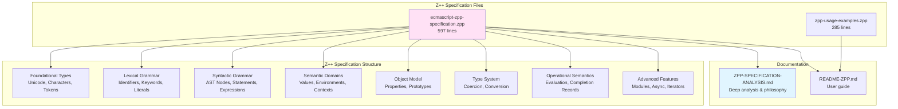

### Specification Verification

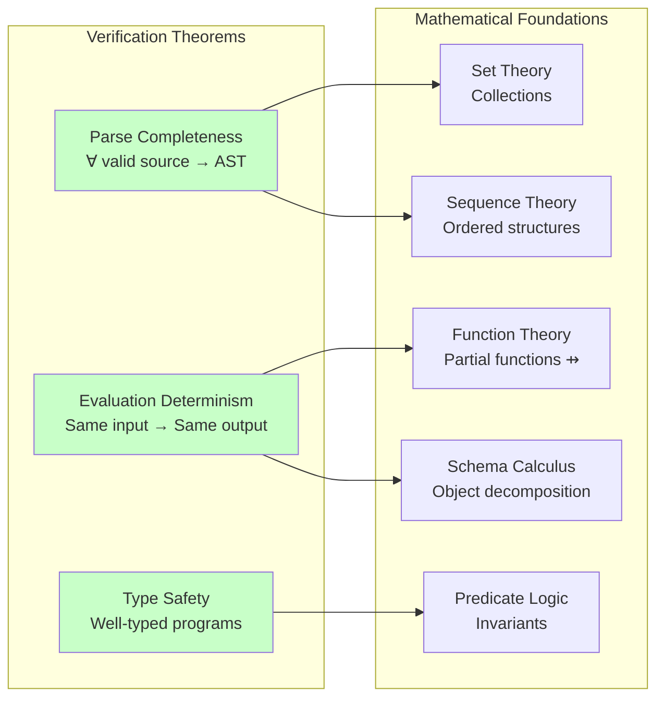

## Integration Boundaries

### External System Integrations

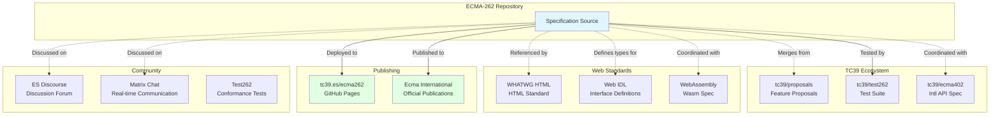

### Proposal Integration Flow

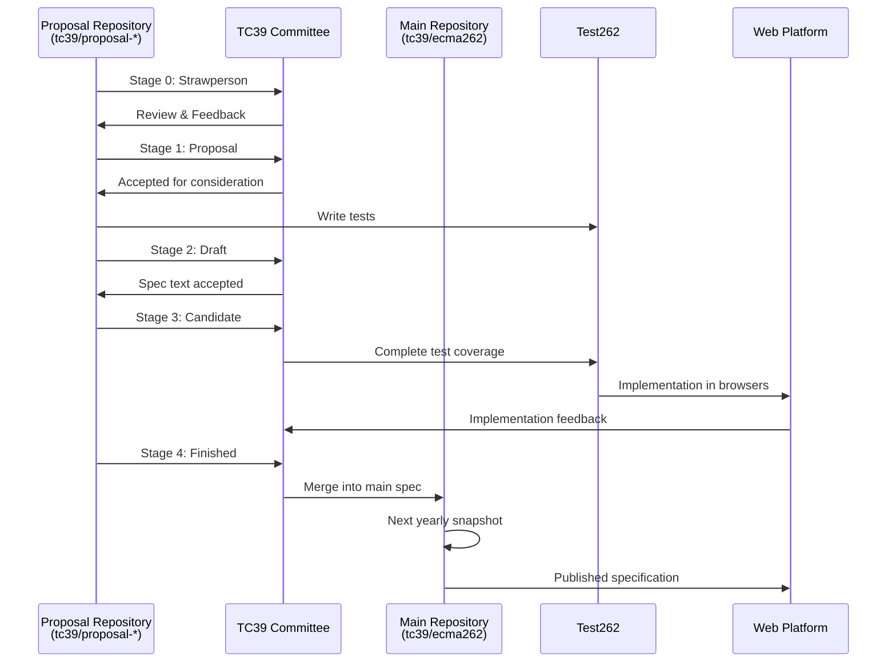

## Build System State Model

The specification build system can be modeled as a state machine:

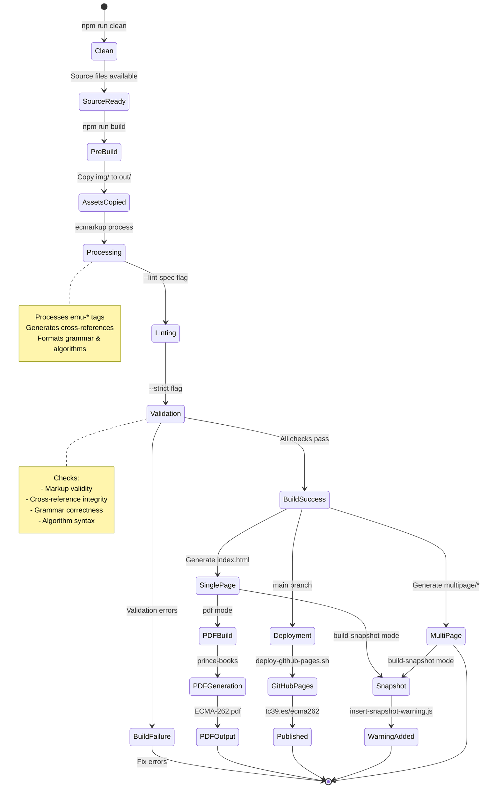

## Quality Assurance & Validation

### Multi-Level Validation Strategy

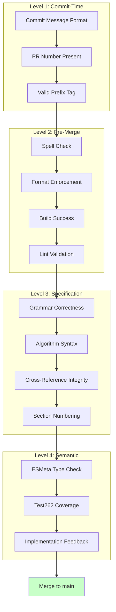

## Repository Metrics

### File Distribution

| Category | Files | Lines | Purpose |
|----------|-------|-------|---------|
| Specification Source | 1 | 53,434 | Main specification document |
| Z++ Formal Specs | 2 | 882 | Formal mathematical specifications |
| Build Scripts | 6 | ~50 | Automation and validation |
| Workflows | 8 | ~500 | CI/CD pipelines |
| Documentation | 10+ | ~2,000 | READMEs, guides, policies |
| Assets | 8 | - | SVG diagrams and logos |

### Build Performance Characteristics

- **Clean Build Time**: ~2-3 minutes (depends on system)
- **Incremental Build**: Not supported (full rebuild required)
- **Watch Mode**: Monitors file changes, rebuilds on save
- **PDF Generation**: +30-60 seconds additional time
- **Deployment**: Automatic on push to main branch

## Architectural Patterns & Design Principles

### 1. **Single Source of Truth**
- All specification content lives in `spec.html`
- No fragmentation across multiple source files
- Supporting tables included via HTML fragments

### 2. **Build-Time Transformation**
- Source uses high-level markup (`<emu-*>` tags)
- Ecmarkup transforms to standard HTML
- Post-processing adds runtime warnings

### 3. **Multiple Output Formats**
- Same source → multiple targets (single/multi-page HTML, PDF)
- Format-specific optimizations during build

### 4. **Strict Validation**
- Multiple validation layers prevent errors
- Fails fast on structural issues
- Enforces consistency through automation

### 5. **Reproducible Builds**
- Package lock ensures dependency consistency
- Version-pinned toolchain
- Deterministic output

### 6. **Community-Driven Workflow**
- Open contribution via GitHub
- Formal proposal process (Stage 0-4)
- Integration with broader TC39 ecosystem

## Future Architecture Considerations

### Potential Enhancements

1. **Incremental Build Support**
   - Cache parsing results
   - Rebuild only changed sections
   - Faster development iteration

2. **Enhanced Z++ Integration**
   - Automated consistency checking between spec.html and .zpp
   - Generate Z++ from specification text
   - Bidirectional synchronization

3. **Advanced Validation**
   - Semantic consistency checking
   - Automated theorem proving
   - Cross-specification dependency analysis

4. **Improved Developer Experience**
   - Live preview server
   - Better error messages
   - IDE integration for Ecmarkup

## Conclusion

The ECMA-262 repository represents a sophisticated document engineering system that combines:
- **Human-readable specification writing** (Ecmarkup)
- **Formal mathematical rigor** (Z++ specifications)
- **Automated quality control** (multi-level validation)
- **Community collaboration** (GitHub-based workflow)
- **Professional publishing** (multi-format output)

This architecture enables the ECMAScript specification to remain authoritative, precise, and accessible to implementers, standards bodies, and the broader JavaScript community.

---

**Document Version**: 1.0  
**Generated**: 2025-11-12  
**Author**: Copilot Agent (Architecture Analysis)  
**Repository**: o9nn/ecma262 (fork of tc39/ecma262)
